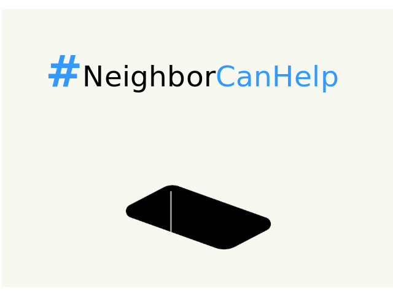
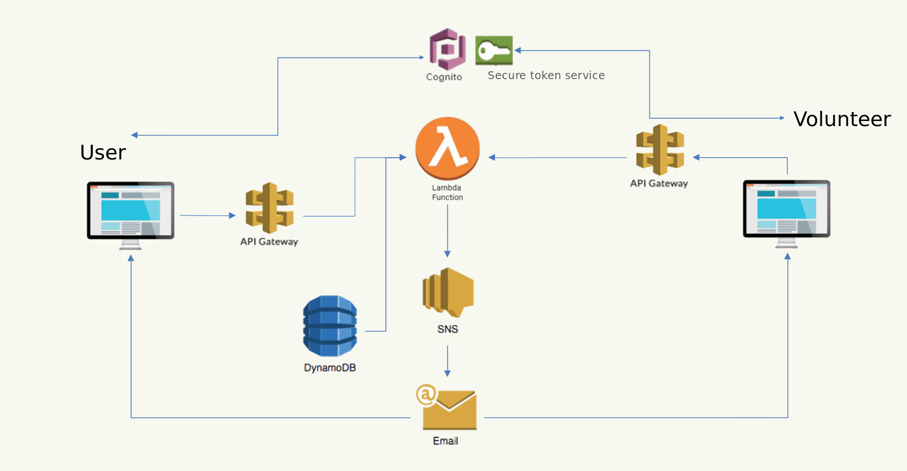

# #NeighborCanHelp - anti pandemic response to the challenges of isolation

## The idea has been created with the eye on the Couchsurfing system, where people are able to help each other without making any material profit

Everyone in the system can be both a volunteer or a one in need. Being able to see what people around you, *your neighbors*, need when you're shopping you can choose the items that you can grab for them.
The type of items is not limited at all: people make request for the things they want and then it's only their neigbors who decide, are they able to buy it or not.

The only profit volunteers gain is the upgrade of their rating based on references of their neigbors. It is used to make one's own requests more visible afterwards.

Our system has been created during pandemic. However, it will have no less use in the post-pandemic world too: mindset of people has changed, irrelevance of making unneccessary contacs has become justified.
Free & community-based alternative to the developing contactless deliveries is needed to make our lives better :)

Since the system was designed and created during two-days hackathon, there's only web interface available for now. Plans are to become user-friendly by working on a decent design along with mobile apps.

Project was started as AWS Serverless Web Application using:
- AWS Lambda
- Amazon Cognito
- Amazon API Gateway
- Amazon DynamoDB
- Amazon Simple Notification Service

Simplified architecture of the system:

This repo contained frontend only, but Python code for serverless operations has been added to [/lambda](/lambda) for the completeness.
